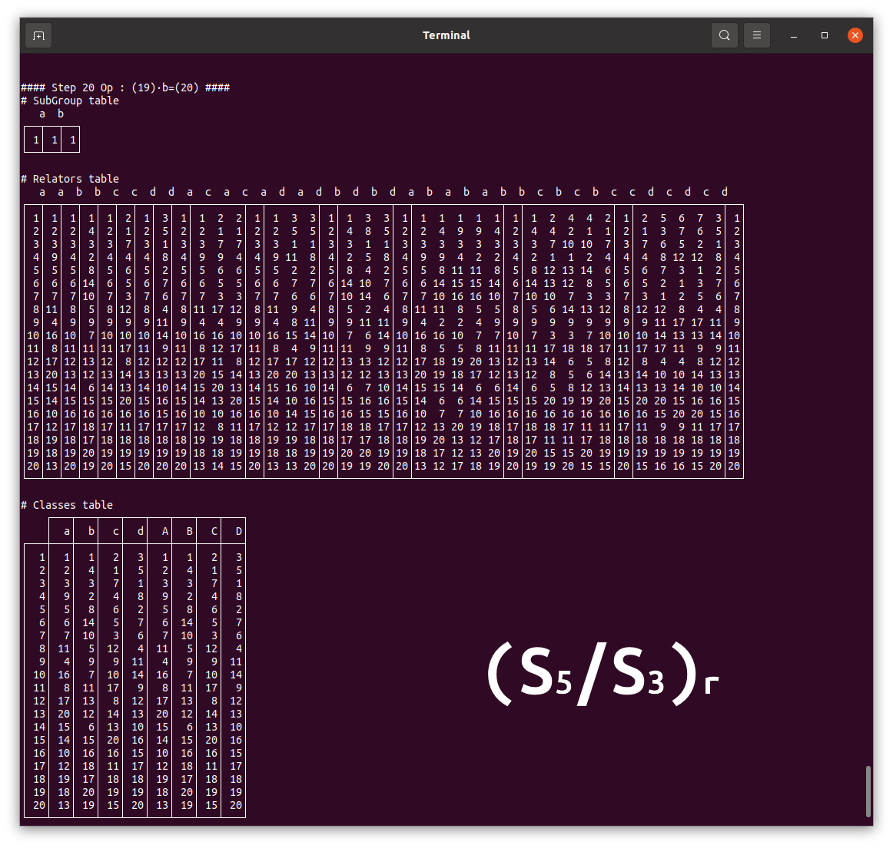

# ToadChaser
Todd Coxeter Algorithm in CSharp for generating Cosets classes for a Subgroup H of a finitely presented group G by generators and relators. (in progress)

By convention x^-1 is denoted X, uppercase character means the invert.
Example :
```
var sg = TableOps.CreateHeader("a");
var rels = TableOps.CreateHeader("a3", "b3", "abab");

var tOps = new TableOps(sg, rels);
tOps.ToddCoxeter();
```
will output
```
#### Step 1 Op : (1)·a=(1) ####
# SubGroup table
  a
┌─┬─┐
│1│1│
└─┴─┘

# Relators table
  a a a b b b a b a b
┌─┬───┬─┬───┬─┬─────┬─┐
│1│1 1│1│   │1│1    │1│
└─┴───┴─┴───┴─┴─────┴─┘

# Classes table
   ┌──┬──┐
   │ a│ A│
┌──┼──┼──┤
│ 1│ 1│ 1│
└──┴──┴──┘


#### Step 2 Op : (1)·b=(2) ####
# SubGroup table
  a
┌─┬─┐
│1│1│
└─┴─┘

# Relators table
  a a a b b b a b a b
┌─┬───┬─┬───┬─┬─────┬─┐
│1│1 1│1│2  │1│1 2  │1│
│2│   │2│  1│2│  1 1│2│
└─┴───┴─┴───┴─┴─────┴─┘

# Classes table
   ┌──┬──┬──┬──┐
   │ a│ b│ A│ B│
┌──┼──┼──┼──┼──┤
│ 1│ 1│ 2│ 1│  │
│ 2│  │  │  │ 1│
└──┴──┴──┴──┴──┘


#### Step 3 Op : (2)·b=(3) ####
# SubGroup table
  a
┌─┬─┐
│1│1│
└─┴─┘

# Relators table
  a a a b b b a b a b
┌─┬───┬─┬───┬─┬─────┬─┐
│1│1 1│1│2 3│1│1 2 3│1│
│2│3  │2│3 1│2│3 1 1│2│
│3│  2│3│1 2│3│    2│3│
└─┴───┴─┴───┴─┴─────┴─┘

# Classes table
   ┌──┬──┬──┬──┐
   │ a│ b│ A│ B│
┌──┼──┼──┼──┼──┤
│ 1│ 1│ 2│ 1│ 3│
│ 2│ 3│ 3│  │ 1│
│ 3│  │ 1│ 2│ 2│
└──┴──┴──┴──┴──┘


#### Step 4 Op : (3)·a=(4) ####
# SubGroup table
  a
┌─┬─┐
│1│1│
└─┴─┘

# Relators table
  a a a b b b a b a b
┌─┬───┬─┬───┬─┬─────┬─┐
│1│1 1│1│2 3│1│1 2 3│1│
│2│3 4│2│3 1│2│3 1 1│2│
│3│4 2│3│1 2│3│4 4 2│3│
│4│2 3│4│4 4│4│2 3 4│4│
└─┴───┴─┴───┴─┴─────┴─┘

# Classes table
   ┌──┬──┬──┬──┐
   │ a│ b│ A│ B│
┌──┼──┼──┼──┼──┤
│ 1│ 1│ 2│ 1│ 3│
│ 2│ 3│ 3│ 4│ 1│
│ 3│ 4│ 1│ 2│ 2│
│ 4│ 2│ 4│ 3│ 4│
└──┴──┴──┴──┴──┘


####     End    ####
```

## Another example



## More Complex example
Let try to study of example of Ken Brown paper : \
The group $G=\langle a,b,c \ | \ a^3=b^2=c^2=(ab)^4=(ac)^2=(bc)^3 \rangle $ \
over the subgroup $H=\langle a,b \rangle$ \
\
First for $H$ we will compute cosets for $(H/\langle a \rangle)_r$
```
var sg = TableOps.CreateHeader("a");
var rels = TableOps.CreateHeader("a3", "b2", "abababab");
var tOps = new TableOps(sg, rels);
tOps.ToddCoxeter();
```
will output
```
#### Step 8 Op : (7)·b=(8) ####
# SubGroup table
  a
┌─┬─┐
│1│1│
└─┴─┘

# Relators table
  b b a a a a b a b a b a b
┌─┬─┬─┬───┬─┬─────────────┬─┐
│1│2│1│1 1│1│1 2 3 4 5 6 2│1│
│2│1│2│3 6│2│3 4 5 6 2 1 1│2│
│3│4│3│6 2│3│6 5 7 8 8 7 4│3│
│4│3│4│5 7│4│5 6 2 1 1 2 3│4│
│5│6│5│7 4│5│7 8 8 7 4 3 6│5│
│6│5│6│2 3│6│2 1 1 2 3 4 5│6│
│7│8│7│4 5│7│4 3 6 5 7 8 8│7│
│8│7│8│8 8│8│8 7 4 3 6 5 7│8│
└─┴─┴─┴───┴─┴─────────────┴─┘

# Classes table
   ┌──┬──┬──┬──┐
   │ a│ b│ A│ B│
┌──┼──┼──┼──┼──┤
│ 1│ 1│ 2│ 1│ 2│
│ 2│ 3│ 1│ 6│ 1│
│ 3│ 6│ 4│ 2│ 4│
│ 4│ 5│ 3│ 7│ 3│
│ 5│ 7│ 6│ 4│ 6│
│ 6│ 2│ 5│ 3│ 5│
│ 7│ 4│ 8│ 5│ 8│
│ 8│ 8│ 7│ 8│ 7│
└──┴──┴──┴──┴──┘


####     End    ####
```
Then $|H|=3 \times 8=24$ \
and \
now lets compute cosets for $(G/H)_r$
```
var sg = TableOps.CreateHeader("a", "b");
var rels = TableOps.CreateHeader("a3", "b2", "c2", "abababab", "bcbcbc", "acac");
var tOps = new TableOps(sg, rels);
tOps.ToddCoxeter();
```
will output
```
#### Step 24 Op : (23)·c=(24) ####
# SubGroup table
   a  b
┌──┬──┬──┐
│ 1│ 1│ 1│
└──┴──┴──┘

# Relators table
   b  b  c  c  a  a  a  a  c  a  c  b  c  b  c  b  c  a  b  a  b  a  b  a  b
┌──┬──┬──┬──┬──┬─────┬──┬────────┬──┬──────────────┬──┬────────────────────┬──┐
│ 1│ 1│ 1│ 2│ 1│ 1  1│ 1│ 1  2  2│ 1│ 1  2  3  3  2│ 1│ 1  1  1  1  1  1  1│ 1│
│ 2│ 3│ 2│ 1│ 2│ 2  2│ 2│ 2  1  1│ 2│ 3  3  2  1  1│ 2│ 2  3  4  5  6  7  3│ 2│
│ 3│ 2│ 3│ 3│ 3│ 4  7│ 3│ 4  7  3│ 3│ 2  1  1  2  3│ 3│ 4  5  6  7  3  2  2│ 3│
│ 4│ 5│ 4│ 7│ 4│ 7  3│ 4│ 7  4  7│ 4│ 5  8  9  6  7│ 4│ 7  6 10 11 11 10  5│ 4│
│ 5│ 4│ 5│ 8│ 5│ 6 10│ 5│ 6  9  8│ 5│ 4  7  6  9  8│ 5│ 6  7  3  2  2  3  4│ 5│
│ 6│ 7│ 6│ 9│ 6│10  5│ 6│10 12  9│ 6│ 7  4  5  8  9│ 6│10 11 11 10  5  4  7│ 6│
│ 7│ 6│ 7│ 4│ 7│ 3  4│ 7│ 3  3  4│ 7│ 6  9  8  5  4│ 7│ 3  2  2  3  4  5  6│ 7│
│ 8│ 9│ 8│ 5│ 8│12  9│ 8│12 10  5│ 8│ 9  6  7  4  5│ 8│12 13 14 15 13 12  9│ 8│
│ 9│ 8│ 9│ 6│ 9│ 8 12│ 9│ 8  5  6│ 9│ 8  5  4  7  6│ 9│ 8  9  8  9  8  9  8│ 9│
│10│11│10│12│10│ 5  6│10│ 5  8 12│10│11 16 17 13 12│10│ 5  4  7  6 10 11 11│10│
│11│10│11│16│11│11 11│11│11 16 16│11│10 12 13 17 16│11│11 10  5  4  7  6 10│11│
│12│13│12│10│12│ 9  8│12│ 9  6 10│12│13 17 16 11 10│12│ 9  8 12 13 14 15 13│12│
│13│12│13│17│13│14 15│13│14 18 17│13│12 10 11 16 17│13│14 15 13 12  9  8 12│13│
│14│15│14│18│14│15 13│14│15 19 18│14│15 19 20 21 18│14│15 14 15 14 15 14 15│14│
│15│14│15│19│15│13 14│15│13 17 19│15│14 18 21 20 19│15│13 12  9  8 12 13 14│15│
│16│17│16│11│16│16 16│16│16 11 11│16│17 13 12 10 11│16│16 17 19 20 21 18 17│16│
│17│16│17│13│17│19 18│17│19 15 13│17│16 11 10 12 13│17│19 20 21 18 17 16 16│17│
│18│21│18│14│18│17 19│18│17 13 14│18│21 20 19 15 14│18│17 16 16 17 19 20 21│18│
│19│20│19│15│19│18 17│19│18 14 15│19│20 21 18 14 15│19│18 21 22 23 23 22 20│19│
│20│19│20│21│20│21 22│20│21 20 21│20│19 15 14 18 21│20│21 18 17 16 16 17 19│20│
│21│18│21│20│21│22 20│21│22 22 20│21│18 14 15 19 20│21│22 23 23 22 20 19 18│21│
│22│23│22│22│22│20 21│22│20 21 22│22│23 24 24 23 22│22│20 19 18 21 22 23 23│22│
│23│22│23│24│23│23 23│23│23 24 24│23│22 22 23 24 24│23│23 22 20 19 18 21 22│23│
│24│24│24│23│24│24 24│24│24 23 23│24│24 23 22 22 23│24│24 24 24 24 24 24 24│24│
└──┴──┴──┴──┴──┴─────┴──┴────────┴──┴──────────────┴──┴────────────────────┴──┘

# Classes table
    ┌───┬───┬───┬───┬───┬───┐
    │  a│  b│  c│  A│  B│  C│
┌───┼───┼───┼───┼───┼───┼───┤
│  1│  1│  1│  2│  1│  1│  2│
│  2│  2│  3│  1│  2│  3│  1│
│  3│  4│  2│  3│  7│  2│  3│
│  4│  7│  5│  7│  3│  5│  7│
│  5│  6│  4│  8│ 10│  4│  8│
│  6│ 10│  7│  9│  5│  7│  9│
│  7│  3│  6│  4│  4│  6│  4│
│  8│ 12│  9│  5│  9│  9│  5│
│  9│  8│  8│  6│ 12│  8│  6│
│ 10│  5│ 11│ 12│  6│ 11│ 12│
│ 11│ 11│ 10│ 16│ 11│ 10│ 16│
│ 12│  9│ 13│ 10│  8│ 13│ 10│
│ 13│ 14│ 12│ 17│ 15│ 12│ 17│
│ 14│ 15│ 15│ 18│ 13│ 15│ 18│
│ 15│ 13│ 14│ 19│ 14│ 14│ 19│
│ 16│ 16│ 17│ 11│ 16│ 17│ 11│
│ 17│ 19│ 16│ 13│ 18│ 16│ 13│
│ 18│ 17│ 21│ 14│ 19│ 21│ 14│
│ 19│ 18│ 20│ 15│ 17│ 20│ 15│
│ 20│ 21│ 19│ 21│ 22│ 19│ 21│
│ 21│ 22│ 18│ 20│ 20│ 18│ 20│
│ 22│ 20│ 23│ 22│ 21│ 23│ 22│
│ 23│ 23│ 22│ 24│ 23│ 22│ 24│
│ 24│ 24│ 24│ 23│ 24│ 24│ 23│
└───┴───┴───┴───┴───┴───┴───┘


####     End    ####
```

Finally, $|G| = 24 \times 24 = 576$

<br><br><br>

## References

[Brown, Ken. The Todd-Coxeter procedure](http://www.math.cornell.edu/~kbrown/7350/toddcox.pdf)